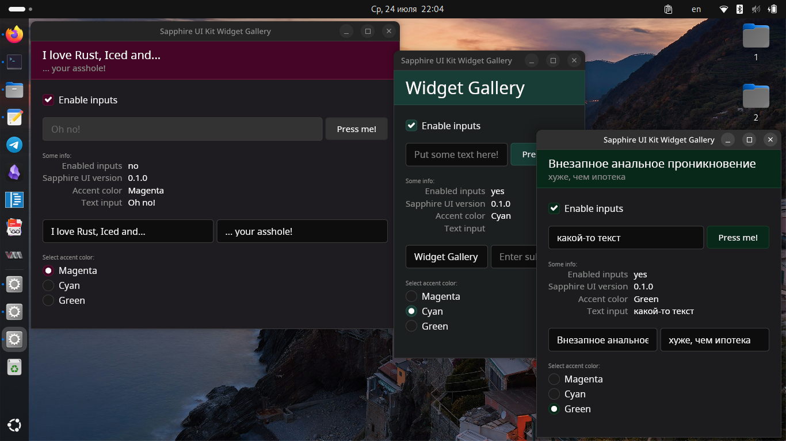

<div align="center">
    
    <h1>Sapphire UI Kit</h1>
    <p><b>Create minimalistic GUIs with Rust, Iced and Sapphire UI Kit!</b></p>
    <h4>
        <a href="https://docs.rs/mskrasnov/latest/sapphire_ui">Documantation (latest release)</a>
        <span> | </span>
        <a href="https://github.com/mskrasnov/sapphire_ui/tree/master/examples">Examples</a>
        <span> | </span>
        <a href="https://github.com/mskrasnov/sapphire_ui/tree/master/donate.md">Support me!</a>
    </h4>
</div>

## About

Sapphire UI Kit contains new themed components for [Iced](https://iced.rs). Sapphire UI Kit is primarily focused on the regular desktop (Linux, Windows, macOS).



Unlike modern libraries for creating graphical interfaces, Sapphire UI does not suffer from excessive gigantism: the design style of widgets is chosen so that widgets look neat and minimalistic. Programs written with Sapphire UI can fit even on screens with a small resolution.

## Structure

The Crate is divided into two large parts: [`theme`](src/theme.rs) and [`widgets`](src/widgets.rs). The `theme` module contains only a styles, while `widgets` contains implementations of these widgets (as functions). Most functions are wrappers over Iced functions, but with modified styles applied. Sometimes it is allowed to change other non-styles parameters (such as widget sizes, fonts, etc.).

## Features

- `svg` - enables SVG support, adds `sapphire_ui::widgets::svg` widget;
- `qr_code` - enables QR-code generation support, adds `sapphire_ui::widgets::qr_code` widget;

## Installation

```toml
sapphire_ui = "0.1.0"
```

## Used in projects

- [resistor](https://github.com/mskrasnov/resistor) -  Программа для вычисления сопротивления резисторов по цветам их маркировки;
- [Cavaletto](https://github.com/mskrasnov/cavaletto) - AI program for image generation;

## Support me

- Use [Boosty](https://boosty.to/linux-for-arm/donate)

## License

Sapphire UI Kit distributed under MIT license.
