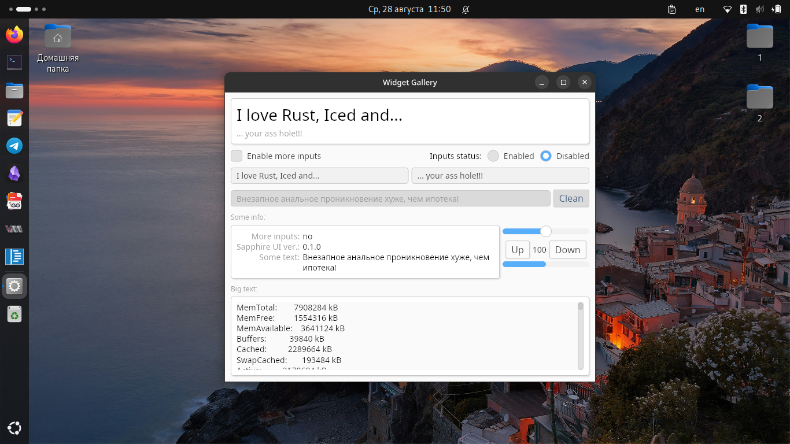

# Sapphire UI Kit

Sapphire UI Kit contains new themed components for [Iced](https://iced.rs). *Uses color schemes from [prettygooey](https://github.com/pieterdd/prettygooey)*. Sapphire UI Kit is primarily focused on the regular desktop (Linux, Windows, macOS).



## Structure

The Crate is divided into two large parts: [`theme`](src/theme.rs) and [`widgets`](src/widgets.rs). The `theme` module contains only a styles, while `widgets` contains implementations of these widgets (as functions). Most functions are wrappers over Iced functions, but with modified styles applied. Sometimes it is allowed to change other non-styles parameters (such as widget sizes, fonts, etc.).

## Installation

```toml
sapphire_ui = "0.1.0"
```

## Usage

```rust
use sapphire_ui::theme::*;
use sapphire_ui::accent::Accent;

use iced::widget::column;
use iced::widget::container;

use iced::Element;
use iced::Sandbox;
use iced::Settings;

fn main() -> iced::Result {
    Text::run(Settings::default())
}

#[derive(Debug, Clone)]
enum Message {
    TitleChanged(String),
    SubTitleChanged(String),
}

struct Text {
    theme: Theme,
    title: String,
    subtitle: String,
}

impl Sandbox for Text {
    type Message = Message;

    fn new() -> Self {
        Self {
            theme: Theme {
                accent_color: Accent::Magenta,
            },
            title: "I love Rust and Iced!".to_string(),
            subtitle: "ЖОПА В КОСМОСЕ".to_string(),
        }
    }

    fn title(&self) -> String {
        format!("Sapphire UI Kit Demo")
    }

    fn view(&self) -> Element<'_, Self::Message> {
        let header = self.theme.header_title(&self.title, &self.subtitle);
        let input = self.theme.text_input("Hello!", &self.text).on_input(Message::TextChanged);

        let title_input = self
            .theme
            .text_input("Put some text here...", &self.title)
            .on_input(TitleChanged);
        let subtitle_input = self
            .theme
            .text_input("Put some text here...", &self.subtitle)
            .on_input(SubTitleChanged);

        let body = column![
            header,
            container(
                column![title_input, subtitle_input,].spacing(10),
            )
            .padding(20),
        ]
        .spacing(5);

        self.theme.primary_container(body).into()
    }

    fn update(&mut self, msg: Self::Message) {
        match msg {
            Message::TitleChanged(text) => {
                self.title = text;
            },
            Message::SubTitleChanged(text) => {
                self.subtitle = text;
            },
        }
    }
}
```

## Features

- [ ] Dark and Light styles;
- [X] Support accent colors;
- [ ] New styles for:
    - [ ] Tabs (from `iced_aw`)
    - [ ] TabBar (from `iced_aw`)
    - [X] scroll panel
    - [X] checkboxes
    - [X] radio buttons (!!!)
    - [X] comboboxes
    - [ ] sliders
    - [ ] progress bars;
    - [ ] text editors;
    - [ ] togglers;
    - [ ] tooltips;
    - [ ] global menus (from `iced_aw`)
    - [ ] context menus (from `iced_aw`)
- [ ] New widgets:
    - [ ] About widget;
    - [ ] File Dialog widget:
        - [ ] Select single file/dir;
        - [ ] Select multiple files/dirs;
- [X] Rewrite API

## Used in projects

- [resistor](https://github.com/mskrasnov/resistor) -  Программа для вычисления сопротивления резисторов по цветам их маркировки;
- [Cavaletto](https://github.com/mskrasnov/cavaletto) - AI program for image generation;

## License

Sapphire UI Kit distributed under MIT license.

## Support me

Users from Russia and Belarus can use [Boosty](https://boosty.to/linux-for-arm).
