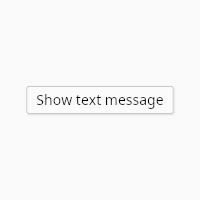
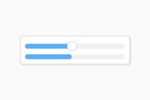
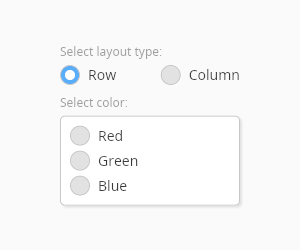
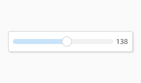
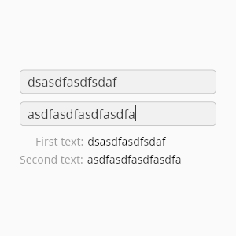
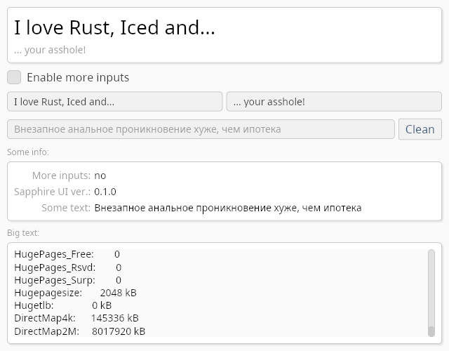

# Examples

## [Button](button/)

An example of using the `sapphire_ui::widgets::button` widget.

## [Progress bar](progress_bar/)

An example of using the `sapphire_ui::widgets::progress_bar` widget.

## [Radio](radio/)

An example of using the `sapphire_ui::widgets::radio` widget.

## [Slider](slider/)

An example of using the `sapphire_ui::widgets::slider` widget.

## [Text input](text_input/)

An example of using the `sapphire_ui::widgets::text_input` widget.

## [Widget Gallery](widget_gallery/)

Example of using most popular widgets.

